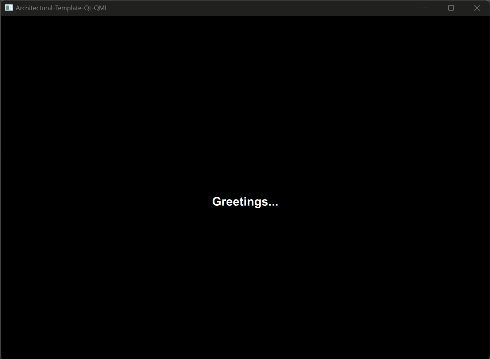

# Architectural-Template-Qt-QML

Пример архитектурного шаблона для многостраничного приложения с графическим интерфейсом, использующего Qt/QML.



## Требования к проекту

- Удобная архитектура UI и backend;
- Удобный deploy;
- Кроссплатформенность;
- Многостраничность;
- Мультиязычность;
- Многотемность;
- Промежуточное сохранение пользовательских настроек;
- Пакетирование;
- Тестируемость.

## Структура проекта
### Основная структура

```
Architectural-Template-Qt-QML
.
│
├───build/ (директория с промежуточными файлами/директориями сборки)
├───deploy/ (директория с файлами для развёртывания приложения)
├───doc/ (директория примерами работы/описанием/документацией)
├───cmake/ (директория с дополнительными файлами для сборки CMake)
├───qml/ (директория с UI файлами)
├───res/ (директория с ресурсами иконки/языки/картинки/шрифты и т.д.)
├───src/ (директория с исходным кодом)
├───tests/ (директория с тестами c++/qml)
├───.gitignore
├───CMakeLists.txt
├───main.cpp
├───main.qml (файл ресурсов для UI - qml, qmldir)
├───qtquickcontrols2.conf (файл с настройками qml)
├───README.md (файл с описанием)
└───resources.qrc (файл ресурсов - картинки, иконки, шрифты, ...)
```

### Структура UI части

```
qml
.
│
├───Common (Модуль с общими фйлами)
│   │
│   ├───Colors.qml (Цвета)
│   ├───Consts.qml (Константы)
│   ├───Enums.qml (Перечисления)
│   ├───Fonts.qml (Шрифты)
│   ├───RegExps.qml (Регулярные выражения)
│   ├───Value.qml (Глобальные переменные)
│   └───... (Literals.qml, Keys.qml, Units.qml, ...)
│
├───External (директория для внешних qml-модулей)
│   │
│   └───...
│
├───Logic (Модуль с файлами js-логики)
│   │
│   └───...
│
├───Models (Модуль с моделями)
│   │
│   └───...
│
├───Pages (Модуль с UI-страницами)
│   │
│   ├───PageLoader.qml (Загрузчик страниц)
│   └───...
│
├───Styles (директория стилизации)
│   │
│   ├───ATQQStyle (директория стилизации шаблонных компонентов QQuick)
│   │    │
│   │    └───...
│   │
│   └───Themes (директория для файлов с цветами для соответствующих тем)
│        └───...
│
└───UILibrary
     │
     ├───Components (модуль для пользовательских компонентов)
     │    │
     │    └───...
     │
     ├───Dialogs (модуль для диалоговых окон)
     │    │
     │    ├───DialogLoader.qml (Загрузчик диалоговых окон)
     │    └───...
     │
     └───Forms (модуль с шаблонными формами для страниц)
          └───...

```
### Структура core/backend части

```
src
.
│
├───controller (Статическая библиотека с контроллерами)
│   │
│   └───...
│
├───core (Статическая библиотека с ядром/основным классом приложения)
│   │
│   └───...
│
├───view-model (Статическая библиотека с моделями отображения - данными для страниц)
│   │
│   └───...
│
└───... (model, transport, dao, entity, handler, ...)
```

### Структура tests части

```
tests
.
│
├───qml-tests (исполняемый файл для тестов qml-компонентов)
│   │
│   └───...
│
└───... (cpp-model-tests, cpp-view-model-tests, ...)
```

## Добавление новых языков

В корне папки выполняем команду, с нужным языковым кодом (например, es_ES - Испанский):
```shell
lupdate * -ts res/languages/ATQQ_es_ES.ts
```
далее требуется открыть данный файл утилитой и вставить перевод.
```shell
linguist
```

## Сборка проекта

Проект может быть собран из QtCreator или из папки build командами:

### CMake:

```bash
cmake ..
make
```
> Для debug - "cmake -DCMAKE_BUILD_TYPE=Debug ..", для release - "cmake -DCMAKE_BUILD_TYPE=Release .."

### QMake:

В данный момент сборка QMake отсутствует.

## Сборка с Docker

1. Установить Docker (для ОС Windows потребуется дополнительно WSL2).
2. Запустить VcXsrv Windows X Server (для ОС Windows).
3. Указать ip в переменную IP_ADDRESS (для перенаправления GUI).
4. Создать образ:
```bash
docker build -t docker-gui -f .\deploy\Dockerfile-Qt-6-5 --build-arg IP_ADDRESS='your ip addres' .
```
5. Запуск контейнера:
```bash
docker run docker-gui
```

## Тестирование QML

Для тестов создан подпроект tests/qmltests. При сборки с ключом --target all или отдельной целью будет создан исполняемый файл с тестами QML-компонентов - QMLTest. Чтобы запустить тесты через консоль, необходимо воспользоваться утилитой qmltestrunner:
```bash
qmltestrunner -input tst_LanguageListModel.qml
```

## Версии

Версии сред, языков и утилит, которые использовались на момент написания проекта.

| Название   | Версия               |
| -----------|----------------------|
| C++        | 20                   |
| Qt Creator | 13.0.2               |
| Qt         | 6.6.3                |
| CMake      | 3.24.2               |
| QMake      | 6.6.3.0              |
| MinGW      | 11.2.0 64 bit        |

Запускалось на:
- [x] Windows 11 22H2
- [x] Ubuntu 22.04 (через Docker)
- [ ] Mac
